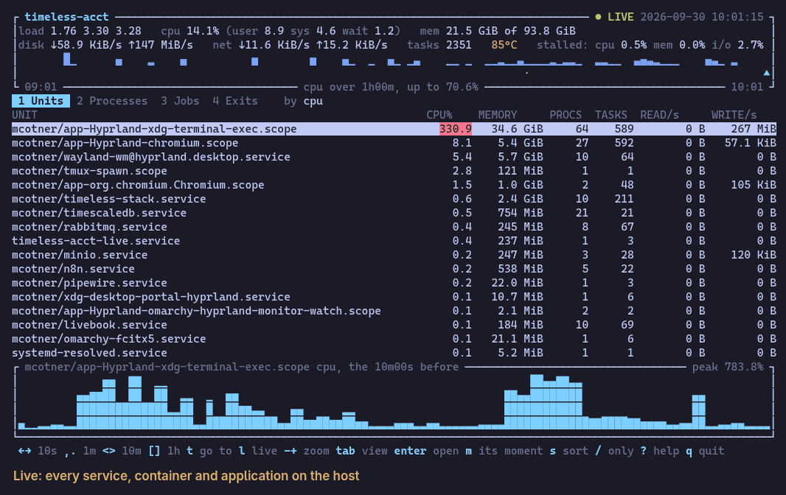

# timeless-acct

**System and process accounting history for Linux, in
[timeless-libsql](https://github.com/awksedgreep/timeless-libsql).**

`timeless-acct` records five things:

- what **sar** records: CPU, memory, swap, paging, disks, interfaces, TCP,
  pressure, filesystems;
- a set of series for every **unit**: each systemd service, each container,
  each desktop application, under a name that outlives a restart;
- a set of series for every **process** that lives long enough to have one;
- an **accounting record for every process that ends**, however briefly it
  lived, with what it was running;
- a **trace for every job**: each build, each pipeline, each run of a
  service, as the tree of processes it was.

It stores them in timeless-libsql, so they can be put on a
[Timeless canvas](https://github.com/awksedgreep/timeless_canvas) and the
timeline dragged back: what was this host doing, and which process was
doing it, at 03:12 last Tuesday.

And it can be watched where it is, in a terminal, with the same timeline.
Here it goes back to a CPU spike from the evening before, steps across
it, finds the compiler that caused it among the processes that ended, and
comes back to now:



That is the viewer on a real store, recorded by
[`tools/demo/rewind.sh`](tools/demo/rewind.sh). A screen of it, as text:

```text
$ timeless-acct watch
┌ timeless-acct ────────────────────────────────────────── ◀ 2026-09-29 16:50:40  10m23s ago ┐
│load 2.01 2.61 2.20   cpu 2.3% (user 1.6 sys 0.5 wait 0.8)   mem 14.8 GiB of 93.8 GiB       │
│disk ↓0 B/s ↑158 KiB/s   net ↓333 KiB/s ↑26.4 KiB/s   tasks 1677   stalled: cpu 0.1% …      │
└────────────────────────────────────────────────────────────────────────────────────────────┘
 1 Units  2 Processes  3 Jobs  4 Exits    by cpu
UNIT                                            CPU%    MEMORY  PROCS  TASKS  READ/s   WRITE/s
mark/app-Hyprland-chromium.scope             23.0   3.9 GiB     16    305     0 B  28.4 KiB
mark/app-Hyprland-xdg-terminal-exec.scope    10.3   6.2 GiB     23    242     0 B   3.6 KiB
mark/wayland-wm@hyprland.desktop.service      5.4   2.8 GiB      9     63     0 B       0 B
mark/timeless-stack.service                   1.5   2.4 GiB     11    230     0 B       0 B
┌ mark/app-Hyprland-chromium.scope cpu, the 10m00s before ──────────────────── peak 26.7% ┐
│                                                                                      ██   ▃│
│                                                                                      ████▆█│
└────────────────────────────────────────────────────────────────────────────────────────────┘
 ←→ 10s ,. 1m <> 10m [] 1h l live tab view ↑↓ row s sort a slices / only ? help q quit
```

```text
$ timeless-acct top --at "2026-09-29 14:45:45"
2026-09-29 14:45:45  (182 processes)
load 2.29 2.16 1.66   cpu 6.1%   mem 13.1 GiB of 93.8 GiB

     PID USER         CPU%       RSS  THR     READ/s    WRITE/s      TIME  COMMAND
   66858 mark         99.4   3.9 MiB    1        0 B        0 B     22.4s  sh
   11564 mark         15.4   704 MiB   37        0 B        0 B     1m55s  chromium
   10102 mark          3.4   248 MiB   36        0 B        0 B     4m39s  chromium

$ timeless-acct exits --status SIGSEGV
ENDED                    PID USER       STATUS      ELAPSED       CPU  PEAK RSS  COMMAND
2026-09-29 14:45:22    66900 mark       SIGSEGV       394ms       1ms   2.3 MiB  sleep
```

That `sleep` lived for 394 milliseconds. No sampler saw it; the kernel
reported it. These lived for one:

```text
ENDED                    PID USER       STATUS      ELAPSED       CPU  PEAK RSS  COMMAND
2026-09-29 16:01:21   131870 mark       3               1ms       2ms   3.9 MiB  sh -c exit 3 marker-sh
2026-09-29 16:01:21   131869 mark       2               1ms       0ms   2.5 MiB  ls /nonexistent-marker-ls
```

And this is one compile, as the kernel saw it:

```text
$ timeless-acct trees --comm cc1
2026-09-29 16:32:21  10 processes over 234ms, cpu 31ms, 2 failed  in mark/app-Hyprland-xdg-terminal-exec.scope  (trace 233db4a69584b3646c1da02a132e7186)
  /bin/sh ./build.sh  234ms, cpu 2ms, 4.0 MiB
  ├─ gcc -O2 -o hello hello.c  27ms, cpu 2ms, 3.4 MiB
  │  ├─ /usr/lib/gcc/x86_64-pc-linux-gnu/16/cc1 -quiet hello.c -quiet -dumpbase…  12ms, cpu 12ms, 36.6 MiB
  │  ├─ as --64 -o /tmp/ccTcxJCk.o /tmp/ccD1Vbk7.s  2ms, cpu 2ms, 4.7 MiB
  │  └─ /usr/lib/gcc/x86_64-pc-linux-gnu/16/collect2 -plugin /usr/lib/gcc/x86_6…  10ms, cpu 1ms, 2.7 MiB
  │     └─ /usr/bin/ld -plugin /usr/lib/gcc/x86_64-pc-linux-gnu/16/liblto_plugin.s…  9ms, cpu 9ms, 9.2 MiB
  ├─ ./hello  0ms, cpu 1ms, 1.5 MiB
  ├─ ls /nonexistent-dir  202ms, cpu 1ms, 2.4 MiB  [exited 2]
  │  └─ sleep 0.2  201ms, cpu 1ms, 2.3 MiB
  └─ grep -c nothing-here /etc/hostname  1ms, cpu 0ms, 2.5 MiB  [exited 1]
```

## Getting started

```sh
cargo build --release
sudo dist/install.sh
```

That installs the collector as a service and starts it recording. Log out
and in again once, so that you may read what it records, and then:

```sh
timeless-acct watch
```

`←` and `→` step back and forward through time, `[` and `]` an hour at a
time, `l` comes back to now, and `q` quits. `?` has the rest.

To stop recording, and to go on:

```sh
sudo systemctl stop timeless-acct
sudo systemctl start timeless-acct
```

To upgrade, build again and run `sudo dist/install.sh` again.
`sudo dist/install.sh --uninstall` removes it, and keeps what it recorded.

### Without installing it

```sh
target/release/timeless-acct run        # Ctrl-C stops it
target/release/timeless-acct watch      # in another terminal
```

This records into your home directory. Without privileges it misses the
processes that end between two samples, and other users' I/O;
`timeless-acct check` says what it can see, and
[running the collector](docs/running.md#by-hand) how to give it the rest.

## More

- [Running the collector](docs/running.md): the service, where the store
  is, privileges, how often it samples, every option, and sending to the
  Timeless planes and a canvas.
- [Watching a store](docs/watching.md): every key of the viewer, and
  finding a process that ended among thousands.
- [Reading a store](docs/reading.md): `top`, `exits`, and `trees`, and SQL.
- [What is recorded](docs/recorded.md): every series, record, and span.
- [What it costs](docs/cost.md): CPU, memory, and disk, measured.
- [DESIGN.md](DESIGN.md): why it is the way it is.
- [CHANGELOG.md](CHANGELOG.md).

## Status

Version 0.2.5. Collection, both sinks, the viewer, and the three query
commands work and
are tested against a live kernel, on a host run by systemd with the unified
control group hierarchy. [What is not here yet](#what-is-not-here-yet)
is listed at the end, and [DESIGN.md](DESIGN.md) explains the decisions.

Linux only, x86-64 and aarch64. Exit accounting needs Linux 5.19 or later to
account a multi-threaded process as one process.

## What is not here yet

- **Units where systemd does not name them.** A unit is recognized by its
  name: `.service`, `.scope`, `.slice`. Containers run by Docker with its
  own control group driver, or by Kubernetes, are in groups named otherwise
  and are not reported.
- **Containers that no unit runs.** One started by hand, with `podman run`
  or `docker run`, is in a scope named for its id and nothing else, and
  all of them are reported together as `libpod.scope` or `docker.scope`.
  Naming them takes asking the runtime.
- **Secrets that are not named for what they are.** See
  [Secrets](docs/recorded.md#secrets).
- **What a forked child turned itself into.** A postgres worker renames
  itself after it starts. Its record has what its parent was running.
- **Jobs longer than an hour.** What a job starts after its first hour is
  a trace of its own, and a job that has been running for longer is not
  among the jobs that are running.
- **A bound on memory**, with a store of its own. See
  [what the store costs in memory](docs/cost.md#what-the-store-costs-in-memory).
- **The end of a series.** Nothing marks a process's series as over, so a
  reader has to be told how far back to look: see
  [Reading with PromQL](docs/running.md#reading-with-promql). It takes the plane as well:
  [timeless-libsql#83](https://github.com/awksedgreep/timeless-libsql/issues/83).
- **Fans and batteries** are collected where the kernel has them, and were
  tested against a host that has neither.
- **Proportional memory** (PSS). `proc_rss_bytes` counts shared pages once
  per process that maps them.

[DESIGN.md](DESIGN.md#what-is-not-here-yet) has the reasoning and the order.

## Testing

```sh
cargo test
```

Parsers are tested against captured kernel text, collectors against a
fixture `/proc`, the taskstats decoder against records built to the
kernel's layout, and the local store against the real engine.

## License

[MIT](LICENSE)
